## Git和GitHub有何区别
1.Git是一款免费开源的分布式版本控制系统   ————工具  
2.GitHub是用Git做版本的代码托管平台      ————平台，就是一个网站  
3.GitHub这个平台是使用git工具来实现版本控制的。git是基础  
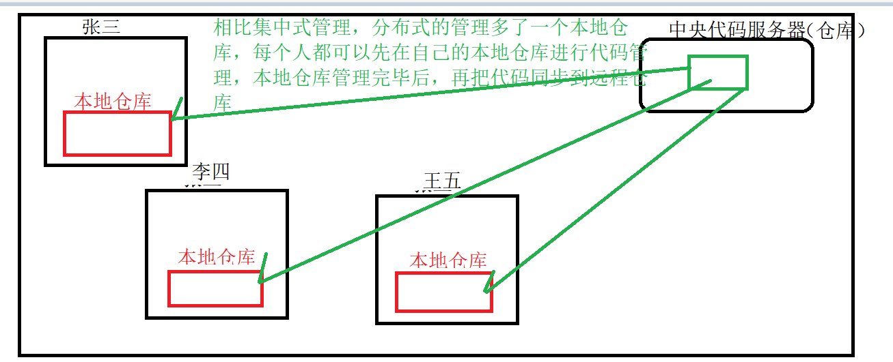
##  如何使用Git
### 1.傻瓜式安装完成后，点击鼠标右键  
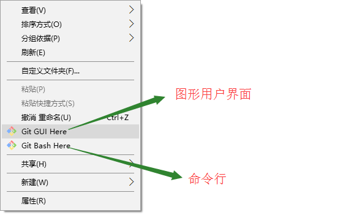  
我们使用bash  
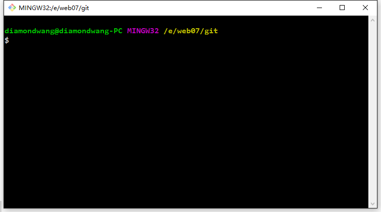  
### 2.典型的使用流程如下：
1. 初始化一个Git仓库（**git init**）  
在选定的目录下。使用git init来进行初始化，
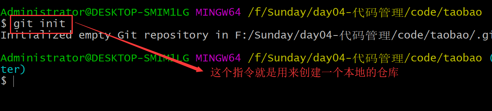  
他会在当前目录下创建一个.git的隐藏目录
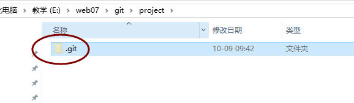
2. 设置用户名和邮箱  
只是在第一次使用git的时候，需要设置，以后就不需要了  
**git config user.name 用户名**  
**git config user.email 邮箱**  

3. 添加文件到仓库（**git add 文件名1 文件名2**） 
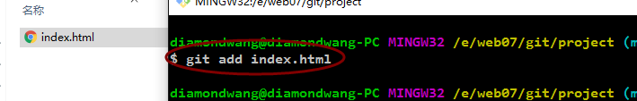
4. 提交（**git commit -m 说明文字**）
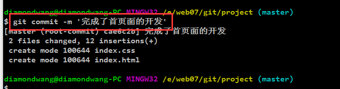
5. 查看版本（**git log**)  
  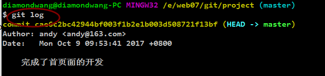
  在开发过程中可以重复3-4两个步骤，比如，需要在首页面中添加一个新的板块，如下：
  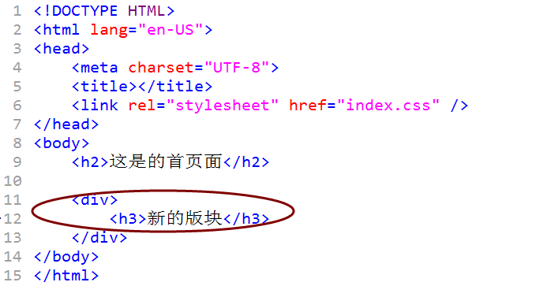
  再次添加文件到仓库然后提交：
  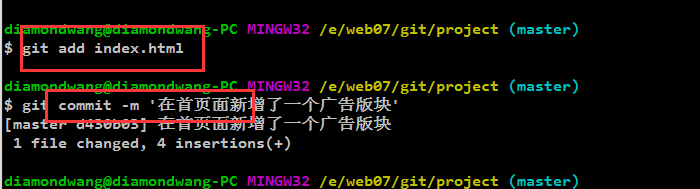
  再次查看版本，如下：
  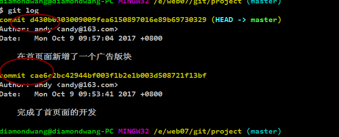
6. 回退（**git reset -hard HEAD^/commit_id**)  
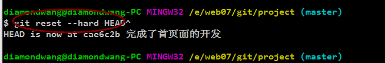
查看页面
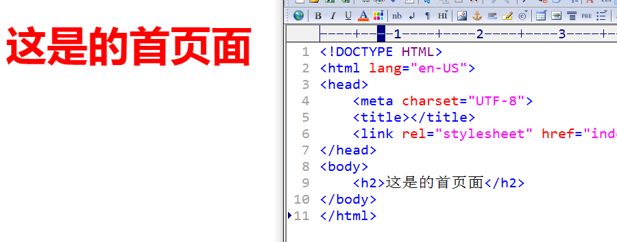
能发现新功能已经不见了  
如果之后想回到之前的版本：  

查看页面
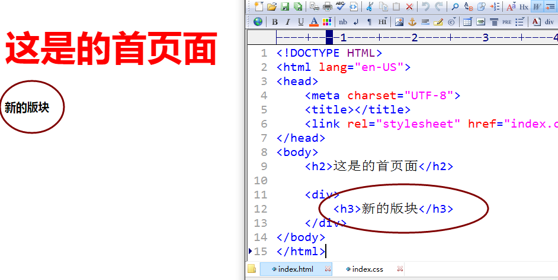

### 另外常用的基本操作
+ git config 对配置进行操作，比如可以使用git config-list查看所有的git配置项
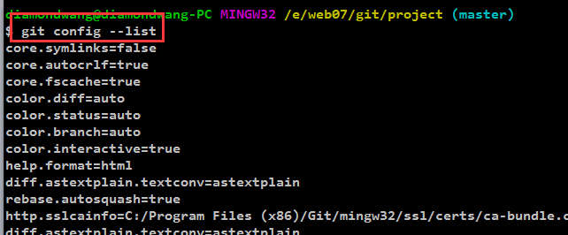
+ git status 显示当前版本仓库的状态
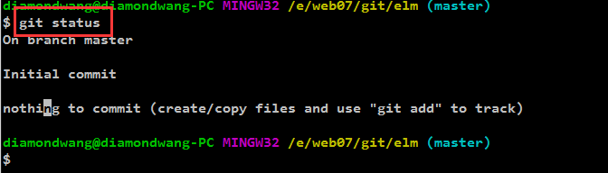
+ git reflog 查看所有版本的回退信息
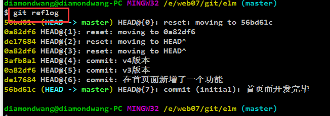
然后就可以回退
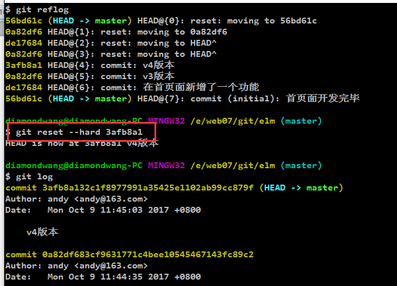

###设置ssh
+ 在本地输入上述 keygen -t rsa -C "邮箱地址"
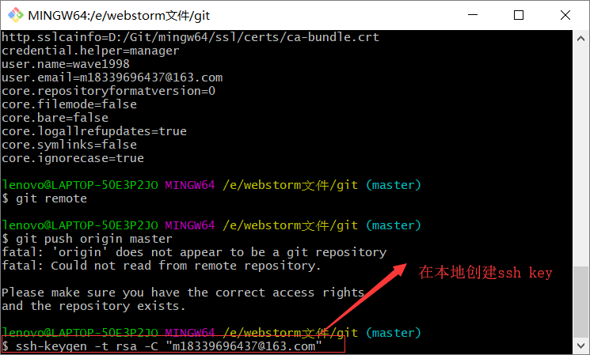
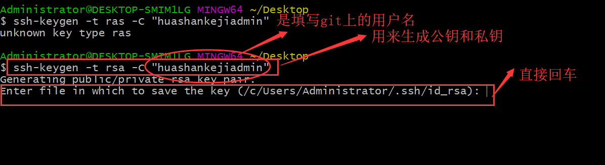
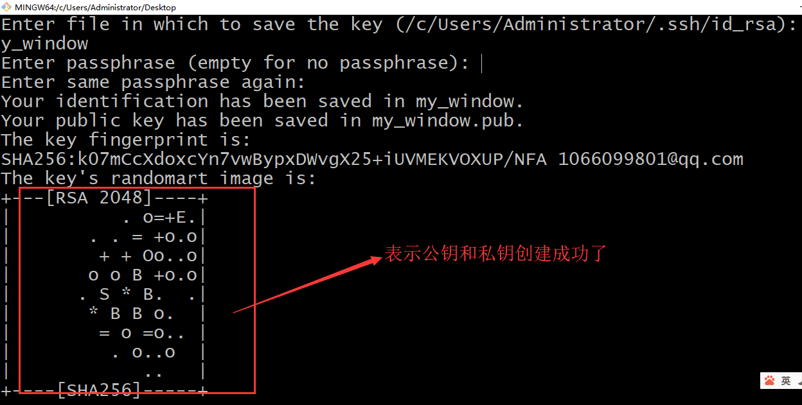
在文件夹中查看密钥，然后打开公钥复制
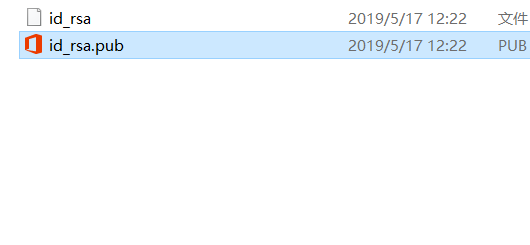
+ 然后在github上创建ssh
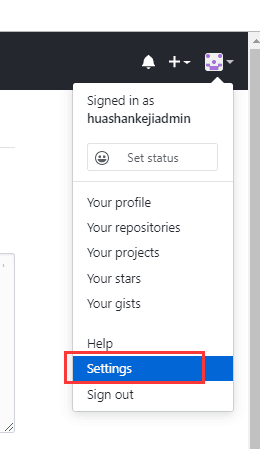
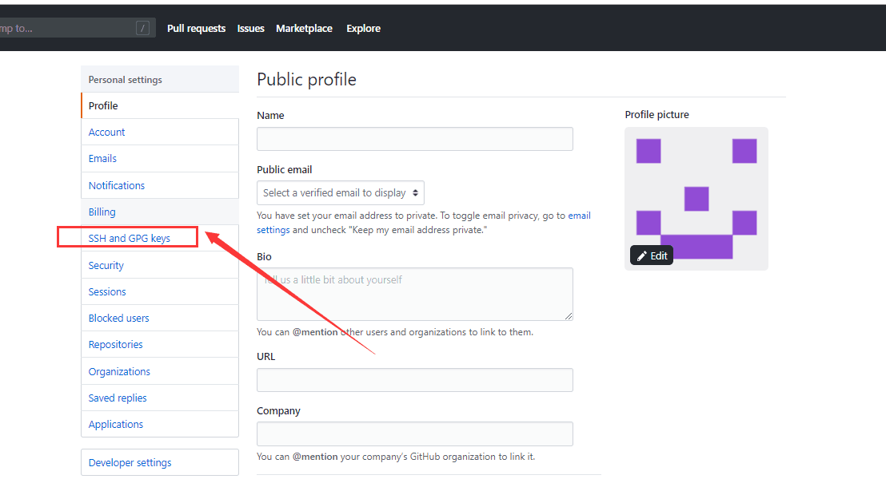
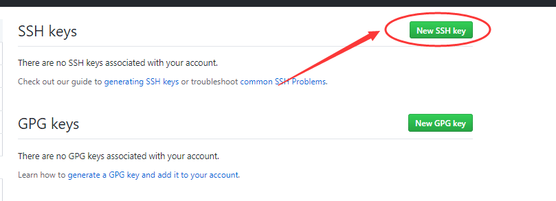
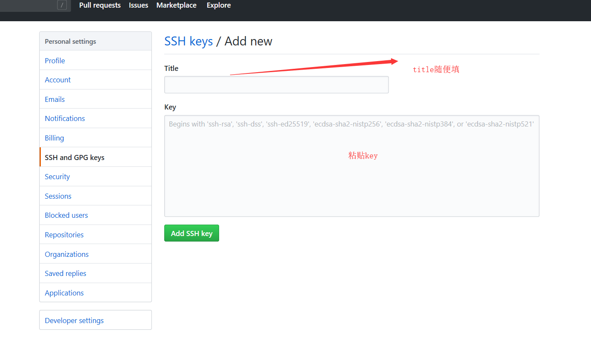
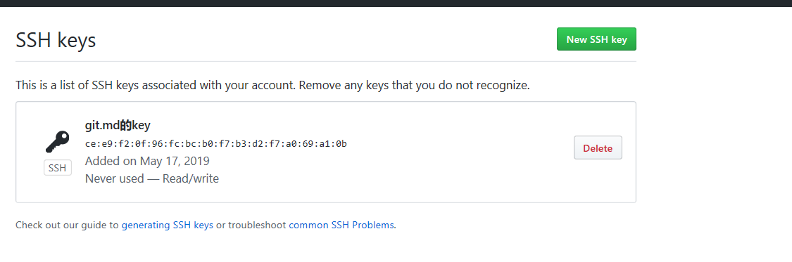
+ 然后在本地开始上传文件
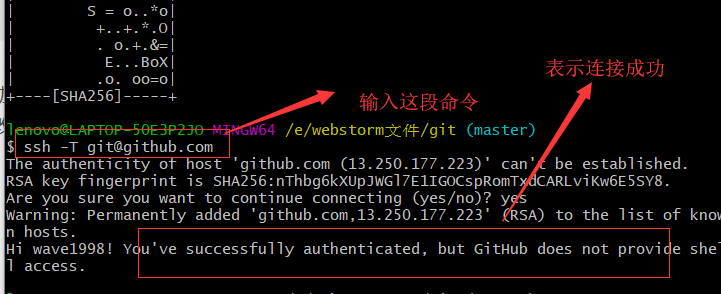
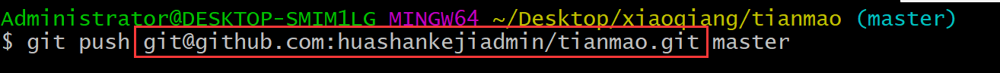
## Git基本概念及原理
### 四大概念
  + 工作区
  + 版本库
  + 暂存区
  + 分支
  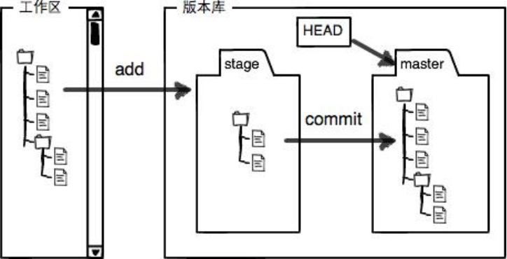
  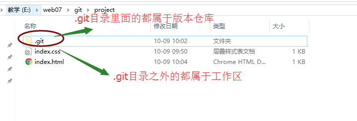
### 工作原理
  + git add命令是将项目放到了暂存区
  +  git commit -m 是将项目提交到了分支
  + git log 查看分支

## 多人协作开发
### github托管代码
### 多人协作的原理
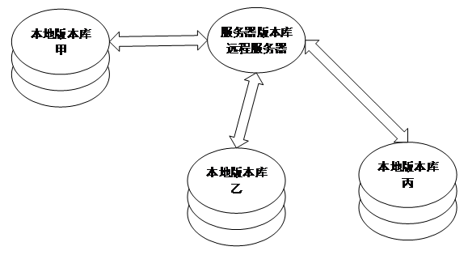 
### 多人协助具体实现
 + 首先注册登录github，之后在GitHub上创建一个仓库，如图
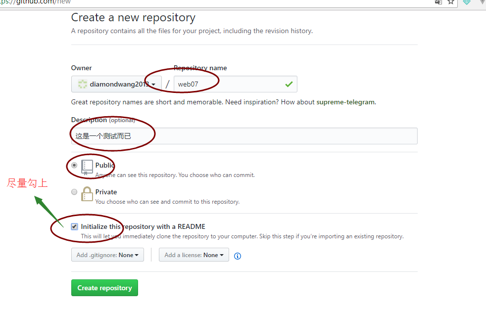
然后复制路径
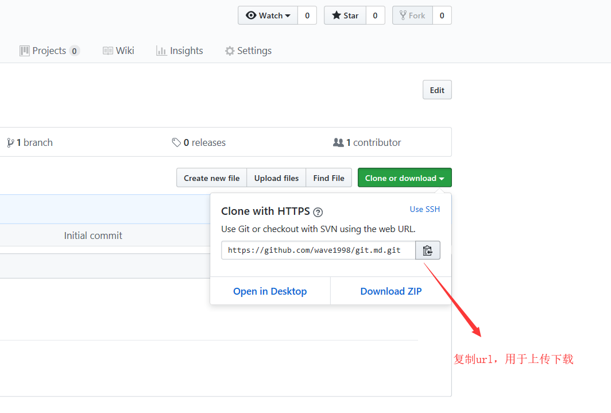
 + 从github将版本库克隆至本地（**git clone**）
 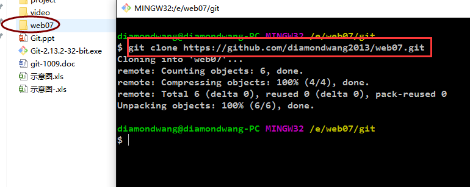
 + 本地常规操作  
 使用上述的Git基本操作进行管理
 + 推送版本至服务器 （**git remote+ git push origin master**）
 首先使用git remote，获取git服务器的名称  
 
 其次我们使用git push 服务器名称 master 来完成推送，使用如下：  
 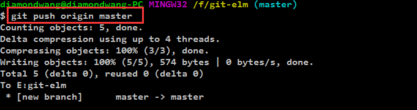

